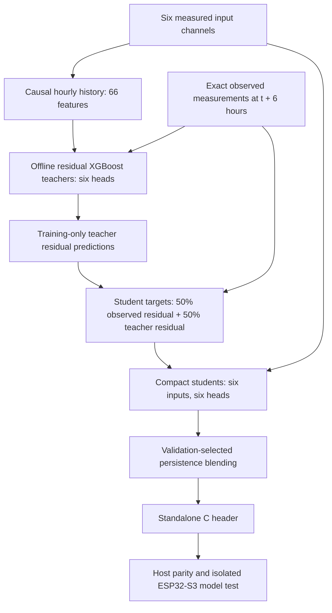

# Six-Sensor Model: Implementation, Training and ESP32 Testing

## Scope and actual completion

This work covers model preparation, training, evaluation, C export, and an
isolated ESP32-S3 model-test build. The trained task is **six-hour-ahead
regression of the six environmental measurements**. The delivered ESP32 model
accepts exactly six floating-point readings and returns six forecast values.
The repository contains model preparation, training, evaluation and export code
and an isolated board test. It does not include a full sensor application.

Training, host tests, Python/C parity, and ESP32 compilation are complete.
Physical flashing and on-device tests are not complete: no ESP32 serial device
was connected during this run. A perfect or production-validated model is not
claimed. The results below are measured offline benchmark results.

## Dataset used by every retained model

The retained model family is **`uci_beijing_6h`**. All six teacher heads and all
six ESP32 student heads were trained on the **UCI Beijing Multi-Site Air
Quality dataset (501)**: 420,768 hourly observations at 12 stations from March
2013 to February 2017. Per-head fitting uses 216,849–219,194 rows after time,
station and missing-measurement filtering; remaining eligible rows evaluate
validation and test performance. The prediction horizon is six hours.

Source: [UCI dataset 501](https://archive.ics.uci.edu/dataset/501/beijing).
Attribution: Chen, S. (2017). *Beijing Multi-Site Air Quality*.
[DOI: 10.24432/C5RK5G](https://doi.org/10.24432/C5RK5G). License: CC BY 4.0.

The adapter verifies the archive SHA-256 and reads only the original 12 station
CSVs. It rejects duplicate keys, converts Beijing local time to UTC, masks
out-of-range measurements, and records provenance and missingness. The source
matches each air-quality site to its nearest meteorological station, so
station separation does not guarantee independent weather sources.

Downloaded observations and the source ZIP are Git-ignored in
`data/uci_beijing_air_quality/`. Its `dataset_manifest.json` is retained as the
dataset record and is also embedded in the model's `training_report.json`.
The removed legacy experiments and synthetic datasets are not dependencies.

## Exactly six model inputs

| Index | Input | Unit | Device source | UCI mapping |
|---|---|---|---|---|
| 0 | `temperature_c` | °C | BME280 | TEMP |
| 1 | `relative_humidity_pct` | % | BME280 | Derived from TEMP and DEWP with the Magnus relation |
| 2 | `pressure_hpa` | hPa | BME280 | PRES |
| 3 | `pm25_ug_m3` | µg/m³ | PMS7003 | PM2.5 |
| 4 | `pm10_ug_m3` | µg/m³ | PMS7003 | PM10 |
| 5 | `wind_speed_mps` | m/s | Wind encoder | WSPM |

Humidity in this training source is an approximation derived from observed
temperature and dew point, not a directly measured RH field. Dew point is used
only in the dataset adapter; it is **not a seventh model input**. The deployed
input remains measured BME280 relative humidity. This source/device difference
must be evaluated with local six-sensor logs before field use.

Gas, CO, CO2, SO2, NO2, ozone, VOC, rainfall, lightning, wind direction, GPS,
station identity, calendar time, and coordinates are not predictive inputs.
Time and station IDs are used only for sorting, history alignment, label joins,
and dataset splits. No GPS coordinates are invented to fit the hazard schema.

## Implemented architecture



### Offline teacher

Each target has its own residual regressor. Its features come exclusively from
the same six input channels: current value; exact 1, 3, 6, 12 and 24-hour lags;
one-hour change; and trailing 6/24-hour means and standard deviations. This
makes 11 features per channel and 66 total. All windows are causal and stay
inside a station. Missing hours are explicitly reindexed; no future fill or
interpolation is used. XGBoost handles missing historical features through its
missing-value branches.

Two depths (4 and 6) are compared on validation MAE. Each candidate uses at most
250 trees, learning rate 0.05, regularization, subsampling, and early stopping
with patience 25. Only trees through the best iteration are saved. Training
uses CPU histogram trees, four threads and seed 42. The choice provides a
measured nonlinear temporal baseline with practical CPU training and a small
export path; a larger neural network was not assumed to be better without data.

### ESP32 student

Each of six heads has **16 trees of maximum depth 3**. All heads take the same
six current inputs; no historical buffer, missing sensor synthesis, or teacher
execution is required on the ESP32. Training targets average the observed
future-minus-current residual and the teacher's predicted residual on training
rows. Validation and test labels are never used to fit the student.

The final prediction for each head is:

```text
clip_to_physical_range(current_value + selected_weight * predicted_residual)
```

Weights in `{0, 0.25, 0.5, 0.75, 1}` are selected by validation MAE. A zero weight
is a persistence fallback. The compact student's own metrics are reported;
its accuracy is not presented as equal to the larger teacher's accuracy.

The C export uses raw input units and float32 tree thresholds/leaf values,
includes the regression base score, and applies the saved blend weights.
It uses no heap allocation. Missing, infinite and out-of-range current inputs
return failure with NaN outputs. Outputs are measurements, not probabilities
or hazard classes. Training cadence is hourly; arbitrary live sampling cadence
and sensor noise have not been field-validated.

## Leakage controls and evaluation

Targets are independently observed measurements at **exactly t + 6 hours**, joined
by station and timestamp. An absent future reading remains unknown and is not
filled or turned into a negative event.

- Training: nine development stations, target timestamp before 2016-01-01 UTC.
- Validation: those stations, input timestamp from 2016-01-01, target timestamp
  before 2016-07-01 UTC.
- Future test: those stations, input timestamp from 2016-07-01 onward.
- Geographic test: Changping, Dingling and Huairou, never used for fitting or
  model selection, evaluated from 2016-07-01 onward.
- Forecast windows crossing train/validation or validation/test boundaries are
  purged. Earlier held-out-station rows are unused for fitting or scoring.

Before missing-label filtering, the partitions contain 223,794 train, 39,258
validation, 52,416 future-test and 17,472 geographic-test rows; 87,828 rows are
unused by those partitions. The actual number fitted is **216,849–219,194 rows
per head**, because training requires all six current readings and an observed
future target. Thus 420,768 is the source size, not the fitted count per head.

Persistence predicts that the future value equals the current reading.
Model/depth/blend selection uses validation only; test scores are reported
without selecting another model from them. MAE, RMSE, R², row counts and skill
against persistence are saved separately for each split. Empirical validation
90th-percentile absolute-error bands have measured test coverage in the report;
these are not guaranteed calibrated intervals under geographic/domain shift.

## Measured results

Lower MAE is better. The following is the future-time test at the nine
training-region stations. Improvement means MAE reduction versus persistence,
not classification accuracy.

| Forecast target | Unit | Persistence MAE | Offline teacher MAE | ESP32 student MAE | Student improvement |
|---|---|---:|---:|---:|---:|
| `temperature_c` | °C | 3.608 | 1.830 | 3.198 | 11.4% |
| `relative_humidity_pct` | percentage points | 15.928 | 9.653 | 14.334 | 10.0% |
| `pressure_hpa` | hPa | 1.839 | 1.301 | 1.793 | 2.5% |
| `pm25_ug_m3` | µg/m³ | 36.382 | 32.301 | 34.919 | 4.0% |
| `pm10_ug_m3` | µg/m³ | 45.851 | 39.858 | 43.525 | 5.1% |
| `wind_speed_mps` | m/s | 0.892 | 0.657 | 0.732 | 18.0% |

Held-out stations, evaluated in the same future period:

| Target | Persistence MAE | Teacher MAE | ESP32 student MAE |
|---|---:|---:|---:|
| `temperature_c` | 3.869 | 2.025 | 3.525 |
| `relative_humidity_pct` | 15.248 | 9.625 | 13.974 |
| `pressure_hpa` | 1.843 | 1.306 | 1.784 |
| `pm25_ug_m3` | 26.887 | 25.844 | 26.243 |
| `pm10_ug_m3` | 35.144 | 33.457 | 34.328 |
| `wind_speed_mps` | 0.924 | 0.697 | 0.746 |

Both model sizes improved MAE for all six targets on both test partitions in
this run. Student improvements are modest for pressure and particulate
forecasts; retaining the teacher's larger accuracy gains would require more
edge capacity or a history-aware student and a new measured comparison.
Beijing performance does not establish performance in Indian mountain terrain.

Full metrics, selected architectures, data hashes, software versions and
provenance: [`ml/models/uci_beijing_6h/training_report.json`](ml/models/uci_beijing_6h/training_report.json).

## Implementation files and reproduction

Run commands from the repository root with Python 3.11 or newer:

```bash
python3 -m pip install -r requirements.txt
python3 -m ml.six_sensor_forecast.data --output data/uci_beijing_air_quality
python3 -m ml.six_sensor_forecast.train --data data/uci_beijing_air_quality --output ml/models/uci_beijing_6h
python3 -m ml.six_sensor_forecast.predict --input data/uci_beijing_air_quality/observations.csv --model ml/models/uci_beijing_6h --kind student --output /tmp/indra_forecasts.csv
python3 -m ml.six_sensor_forecast.export --model ml/models/uci_beijing_6h --observations data/uci_beijing_air_quality/observations.csv --output ml/models/uci_beijing_6h/esp32_student/export
python3 -m unittest tests.test_six_sensor_forecast
pio run -d esp32/model_test
```

`data.py` downloads and validates the source. `features.py` is shared by
training and batch inference. `train.py` fits and evaluates both model sizes.
`predict.py` checks model hashes and writes keyed forecasts. `export.py` emits
and verifies C. The 12 saved `.ubj` files are real trained models, not drafts.
The generated C header is used directly by the isolated ESP32 model test.

The dedicated requirements file records the tested package versions.
`training_report.json` also records the training environment. Source hashes are pinned;
replacing the source requires an explicit reviewed checksum change. Re-running
training can produce different binary bytes across toolchain/platform versions;
regenerate and re-run parity after changing model artifacts.

## ESP32 export and test status

- Export: [`indra_six_sensor_forecast.h`](ml/models/uci_beijing_6h/esp32_student/export/indra_six_sensor_forecast.h).
- Model structure: six heads, 96 trees total, maximum depth 3, 1,438 total nodes.
- Header source size: see `c_export_report.json`. This is source text size, not flash/RAM use.
- Python/C parity: **4,063 valid rows**, including tree-threshold neighbors and
  physical boundaries, plus **18 rejected invalid cases**. Maximum absolute
  difference across outputs: approximately **0.0000311**, below 0.0002 tolerance.
- Unit/integration tests: causal features, station isolation, missing-hour
  alignment, horizon purging, schema rejection, saved-model inference,
  invalid-input behavior, checksum tampering and compiled C parity.
- ESP32-S3 build: **passed**. Complete isolated Arduino test image uses
  **282,445 bytes flash and 18,448 bytes static RAM**. These figures include the
  framework. They are not model-only memory measurements or runtime stack peaks.
- Physical flashing, measured device latency and live sensor tests: **not run**;
  no connected ESP32 was detected.

The smoke test reads its fixed test vector through volatile storage so the
compiler cannot remove the model by folding constant predictions. It prints
six forecast values, model status and inference time when actually run on a
board. For its `[20, 50, 1013, 35, 60, 2]` input, host-verified expected outputs
are approximately `[18.554806, 56.758118, 1012.819641, 41.744591, 72.887955, 1.689997]`.

To upload the isolated test after connecting the intended ESP32-S3:

```bash
pio run -d esp32/model_test -t upload --upload-port /dev/cu.YOUR_ESP32_PORT
pio device monitor --port /dev/cu.YOUR_ESP32_PORT --baud 115200
```

Uploading replaces the board's current application with this model-only test.
The source is at `esp32/model_test/src/main.cpp`. The build output is
local under its `.pio/build/esp32-s3-model-test/` directory. Export/build evidence
is saved in `ml/models/uci_beijing_6h/esp32_student/export/c_export_report.json` and
`ml/models/uci_beijing_6h/esp32_build_report.json`.

## Remaining model evidence

The model implementation and offline test work are complete. Physical ESP32
execution and validation with local measured six-channel logs remain. If the
required deliverable is storm/flood event classification, independently
verified event labels and a separate hazard evaluation are also still needed;
this forecasting benchmark cannot substitute for them.
