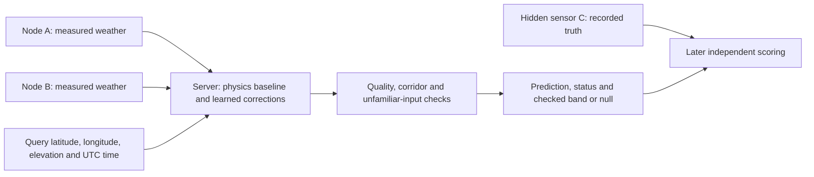
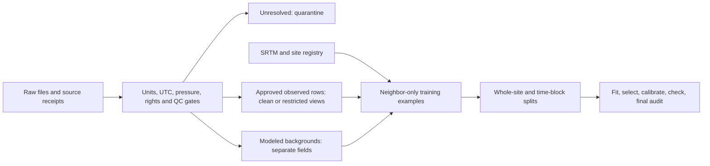

# INDRA: project overview

**Confidential: do not publish before IP review.** This includes the separate [INVENTION_NOTES.md](../INVENTION_NOTES.md). No claim of patent novelty is established.

Evidence cutoff: 3 October 2026. This is the main project guide. Original reports remain available through the source map and archive. **The software prototype works in offline tests; reliable field deployment between two ESP32 nodes has not been demonstrated.**

5 October supplement: [India sensor-risk audit](INDIA_SENSOR_RISK_PLAN.md) and [executed sensor-only forecast phase](../reports/india_sensor_phase/REPORT.md). This adds same-node future measurement thresholds, separate from interpolation; cloudburst/flood/landslide heads remain unavailable. Older spatial scores below are unchanged.

6 October software update: [offline completion report](../reports/offline_phase/REPORT.md) and [A–D tables/losses](../reports/offline_phase/RESULTS.md). Four protocols now include whole-site, whole-Himalaya-proxy, temporal-only and Himalayan-only tests. All 374 archive feature matrices were exactly rechecked; 61 selected fits reproduce identical model bytes. Cutoffs/weights use validation only. Wind recall remains zero; geography does not consistently help. PM/hazard truth is still insufficient. A national same-node forecast C export is host-tested and ESP32-S3 cross-compiled; **not hardware validated**. The existing spatial results below are unchanged.

Independent-label/background update: [hazard audit](hazard_label_audit.md) and [ERA5 context phase](../reports/hazard_context_phase/REPORT.md) prepare event admission, monitored negatives, event-disjoint matching and a separate retrospective S/SB comparison. Real event/ERA5 data is missing; no disaster output or previous score changed. The test-only GCC repair is verified by remote CI.

## 1. What this project is

INDRA is an AI weather mesh network project for a course at IIT Mandi. A mesh is a group of communicating sensor nodes. The intended deployment has exactly two transmitting nodes, A and B. Given their readings and a query latitude, longitude and elevation, a server estimates weather between them. A third instrument, C, measures the hidden test point; its readings are withheld from prediction and used only for scoring.

This is **current-weather interpolation**, meaning estimation at an unmeasured location. The repository also contains an older six-hour forecast and an event-rule experiment. Those answer different questions and do not validate between-node weather predictions.



Arrows describe the intended system; live sensor drivers, radio transport and authenticated ingestion remain unfinished. The implemented demo reads files on a computer.

## 2. What has been built

“Done and tested” means software/archive tests, unless stated otherwise.

| Item | Status | Evidence and boundary |
|---|---|---|
| Six-channel contract | Done and tested | T °C, RH %, station pressure hPa, PM2.5/PM10 µg/m³, wind m/s, in that order; fewer than six physical devices may supply them. |
| India sensor-only threshold forecasts | Partly done | Indian NOAA A–D comparisons and causal features tested; independent field/hazard validation missing. PM optional; suspect pressure/height masked. |
| Four-channel spatial model; optional PM | Partly done | Weather works without PM. Separate target predictors (“heads”) mask missing labels; current spatial PM heads are untrained. |
| Registry and long-form store | Done and tested | One variable per row; source/site IDs, hashes, units, UTC intervals, quality/reference flags; clean/restricted separation. |
| All-source ingestion | Partly done | NOAA/NWIC/POWER have real execution evidence; other adapters limited/synthetic. Unresolved sources quarantined; ERA5 join pending. |
| Terrain | Partly done | SRTM elevation/slope and elevation differences implemented; some stations missing terrain. Latest two-node heads exclude query slope. |
| Spatial ensemble | Done and tested | Combines predictors; separately trained 2/3/4/5-neighbor models; boosting and small neural network correct physics baselines on the server. |
| Physics baselines | Done and tested | Lapse-adjusted T, dewpoint-based RH, common-height pressure; wind inverse-distance weighting (IDW). Losses reported below. |
| Geometry checks | Done and tested | Two-node corridor: ≤1 km from segment, ≤0.25 km beyond ends, A–B ≤20 km. 3–5 use a hull (enclosing polygon); refusal/flagging tested. |
| Out-of-distribution (OOD) and fallback | Done and tested | Unfamiliar inputs: selected fitted-range violations or learned failure fall back to available physics; missing contributors can refuse. |
| Sensor quality control (QC) | Partly done | Range/nonfinite/stale/coordinate/time and pressure/elevation checks; plausible wrong units, stuck sensors, drift/spoofing remain gaps. |
| Error bands | Partly done | Block calibration/check/revocation tested; no checked two-node 80/90% band. |
| A/B/C offsets and scorer | Done and tested | Frozen relative calibration and hidden-label isolation tested synthetically; no field campaign. |
| ESP32 firmware | Partly done | Serial forecast/event replay, host parity and compilation; no autonomous sensor/radio node or spatial model. |
| Field reliability/authentication | Not done | No hardware soak, authenticated mesh or field outage/accuracy proof. |

The ensemble combines a physics prediction with weighted learned **residuals**, differences from that baseline. Validation selects weights and correction strength, including zero. It protects aggregate validation error, not future/individual predictions. Bounded numeric JSON replaces executable pickle loading.

Pressure uses temperature-aware barometric reduction to 0 m EGM96, log-pressure interpolation, then query-height restoration; this is not certified sea-level pressure. Temperature uses 6.5 K/km; RH comes from interpolated dewpoint and adjusted temperature. Mountain inversions/exposure can violate these assumptions.

## 3. Requirements and running it

Validation needs three instruments: A/B transmit and C stays hidden. Existing firmware targets **ESP32-S3-DevKitC-1-N8, 8 MB flash**. User-specified parts: BME280 (T/RH/pressure), PMS7003 (PM), 600 PPR encoder (wind rotation), Neo-M8N GPS, INA219 power monitoring and DS3231 RTC. **Installed wiring, shielding, calibration and operation are unverified**; encoder PPR alone does not establish m/s or wind azimuth.

Use isolated Python 3.11.8; root dependency pins differ from the tested spatial phase. Full tests need a C/C++ compiler; firmware builds need PlatformIO.

```sh
# From the repository root; installation needs package access.
python3.11 -m venv .venv-physics
. .venv-physics/bin/activate
python -m pip install -r requirements-physics.txt xgboost==3.1.1
python -m pytest -q

# Synthetic A/B demo, with physics only; prints prediction/bands/status.
python -m reports.practicum.demo --input reports/two_node_phase/examples/readings.json

# Optional learned model, if the local trained artifact is present.
python -m reports.practicum.demo --input reports/two_node_phase/examples/readings.json --model data/two_node_training/national5km/k2/model.json

# Reproduce the eight archive experiments after acquiring the same NOAA inputs.
python -m ml.spatial_ensemble.evaluate_two_nodes
# Compile only; requires PlatformIO and its board packages.
pio run -d esp32/ml_integration -e esp32-s3-ml -e esp32-s3-ml-usb
```

Raw arrays/models may be absent in a fresh checkout. Clean installation/download commands were not replayed in consolidation. See [node collection and scoring](../reports/nwic_pipeline/NODE_COLLECTION_SPEC.md) and [firmware build/replay](../esp32/ml_integration/README.md) for detailed contracts. Demo A/B values must already be offset-corrected; C readings are forbidden in its input.

CDS needs accepted terms/account/token or manual download; OpenAQ needs a v3 key/provider rights; IMD needs authorized access. None was bypassed. [ERA5 download specification](../reports/physics_phase/ERA5_DOWNLOAD.md) lists 24 monthly India requests for 2023–2024: all UTC hours, T2m, dewpoint, surface pressure and 10 m u/v wind, area `[38,68,6,98.5]`. Files belong in `data/backgrounds/raw/era5_land/`. Actual downloads and completed-hour joins remain pending.

## 4. Data sources and rights

“Clean” is the approved open-license target view, not certified quality. Restricted rows stay separate; unresolved rights/time/units/reference block both views. These are recorded terms, not new legal clearance. Full evidence: [DATA_LICENSES.md](DATA_LICENSES.md).

| Source | What it gives / resolution | Recorded license; commercial use | Current view/use |
|---|---|---|---|
| NOAA GHCNh | Point hourly/synoptic T/RH/dewpoint, station pressure, wind; 2023–2024 | CC0-1.0; permitted under recorded terms | Clean observed targets; latest spatial fits |
| SRTM GL1 v3 | Static ~30 m elevation and derived slope | USGS public-domain product; mirror attribution | Terrain inputs, not weather targets |
| Köppen-Geiger | 1 km 1991–2020 climate zones | CC BY 4.0; with attribution | Registry/evaluation grouping |
| UCI Beijing 501 | 420,768 hourly rows, 12 sites, 2013–2017; six channels with RH derived | CC BY 4.0; with attribution | Older forecast/event models; not approved new spatial targets where contracts unresolved |
| CPCB/Kaggle v2 | Seven downloaded station samples, 368,462 hourly rows; weather/PM availability varies | CC BY-NC-SA 4.0; non-commercial only | Older restricted research models; new restricted-view admission still contract-gated |
| Delhi OpenCity/CPCB | Two 15-minute exports, 2024–2025; one weather+PM, one PM-only | “Other (Public Domain)”; primary rights unresolved | Quarantined audit only |
| NWIC Himachal weather | Four hourly channels, 30 identities; no PM | “other-open”; exact terms unresolved | All 1,571,295 supplied rows quarantined |
| NWIC rainfall / legacy T | 166,355 rain rows, no explicit dry hours; legacy T download only four rows | “Other (Open)” / unverified; unresolved | Audit only; neither target view |
| NASA POWER | Coarse modeled hourly weather; January Mandi diagnostic obtained | Free NASA data, attribution; recorded open class | Background/clock diagnostic, not observed truth |
| ERA5 / ERA5-Land | Hourly modeled grids: 0.25° / 0.1° (~9 km native Land) | Registry CC-BY; accept current CDS terms | Not acquired; planned `era5_*` background only |
| IMD | Station catalogs obtained; observations need authorization | Unverified export terms; commercial rights unresolved | No new observation targets |
| OpenAQ | Point PM; provider-dependent cadence and rights | Provider-specific; unresolved | Key/data not obtained; no PM training |
| Sensor.Community | Consumer PM and some weather, variable cadence | Content/database terms unresolved | Not acquired/approved |
| CAMS EAC4 | Modeled PM/background, 3-hourly 0.75° | Registry CC-BY; accept provider terms | Not acquired; never measured PM truth |



NOAA: 586 India-coded candidates; 375 acquired 2024 files, 360 also in 2023. Retained 1,516,003 hour buckets, including 775,778 calendar-2024 hour-end buckets; missing hours stay missing. Alias exclusion leaves 374 sites. Channel availability varies; hidden-site readings/aliases are excluded.

## 5. Results: wins and losses

**All numbers in the four core tables are real NOAA archive diagnostics, not synthetic or field deployment results.** These are separately fitted two-neighbor models, whole held-out stations, December audit, national 5 km buffer or Himalaya-proxy 20 km buffer. The Himalaya proxy is 28–37°N, 72–90°E, elevation ≥500 m. Models considered acquired 2023/2024 hours without row caps; national/Himalaya fits contain 462227/541231 rows. Only rows with eligible target truth enter each metric.

Mean absolute error (MAE) averages absolute prediction misses; lower is better. Core values copy the three-decimal [latest report](../reports/two_node_phase/REPORT.md). Persistence copies the full-precision [results.csv](../reports/two_node_phase/results.csv): it holds the previous one-hour **neighbor IDW**, never hidden query history. Pressure persistence has zero pairs. The CSV retains root mean squared error (RMSE), station-resampled 95% MAE intervals and denominators; mean-error intervals are not prediction bands.

### Temperature (°C MAE; real archive)

| Hold-out / rows | Ensemble | Physics | IDW | Nearest | Mean | Persistence |
|---|---:|---:|---:|---:|---:|---:|
| National / 8313 | 1.735 | 2.159 | 2.696 | 2.799 | 2.677 | 2.6964614391326904 |
| Himalaya / 1878 | 4.507 | 4.942 | 8.540 | 8.325 | 8.938 | 6.822472095489502 |

### Relative humidity (percentage-point MAE; real archive)

| Hold-out / rows | Ensemble | Physics | IDW | Nearest | Mean | Persistence |
|---|---:|---:|---:|---:|---:|---:|
| National / 8305 | 10.871 | 13.797 | 10.768 | 11.692 | 10.543 | 11.096077919006348 |
| Himalaya / 1869 | 21.763 | 22.553 | 16.499 | 16.953 | 16.130 | 18.22036361694336 |

**Loss:** national RH loses to IDW and mean; Himalayan RH loses to all three raw spatial baselines and persistence.

### Station pressure (hPa MAE; real archive)

| Hold-out / rows | Ensemble | Physics | IDW | Nearest | Mean | Persistence |
|---|---:|---:|---:|---:|---:|---|
| National / 2688 | 4.059 | 4.059 | 36.541 | 35.092 | 39.447 | Unavailable |
| Himalaya / 1240 | 18.945 | 18.637 | 117.687 | 119.232 | 115.429 | Unavailable |

**Loss:** Himalayan residual correction worsens the physics baseline. Elevation correction greatly improves raw interpolation here, but Himalayan absolute error is still large.

### Wind (m/s MAE; real archive)

| Hold-out / rows | Ensemble | Physics | IDW | Nearest | Mean | Persistence |
|---|---:|---:|---:|---:|---:|---:|
| National / 8207 | 0.908 | 1.054 | 1.054 | 1.108 | 1.061 | 1.453328251838684 |
| Himalaya / 1904 | 0.611 | 0.632 | 0.632 | 0.789 | 0.688 | 1.4415870904922485 |

### PM2.5 (µg/m³; current spatial task)

| Evidence | Ensemble | IDW | Nearest | Mean | Persistence |
|---|---|---|---|---|---|
| No real spatial labels in latest fits | Untrained | Not evaluated | Not evaluated | Not evaluated | Not evaluated |

### PM10 (µg/m³; current spatial task)

| Evidence | Ensemble | IDW | Nearest | Mean | Persistence |
|---|---|---|---|---|---|
| No real spatial labels in latest fits | Untrained | Not evaluated | Not evaluated | Not evaluated | Not evaluated |

Synthetic fixtures test behavior, not real PM skill. Older PM forecasts and event-rule scores are different tasks.

K=3–5 does not uniformly improve errors; matched-row scores remain in the report. An earlier specialist won on eight Mandi reports, insufficient to establish a two-node winner.

**Deployment coverage: zero two-node audit rows pass the default corridor.** Minimum national test A–B spacing is 25.36 km; Himalayan is 79.75 km. Training has only 2828 national and 12958 Himalayan pair-time rows at 1–20 km; repeated hours are not independent sites. No checked two-node band exists at either 80% or 90%; outputs correctly return null.

## 6. Limitations

- No real fixed-node 1–20 km validation or hidden C campaign. Archive context pairs change with availability; deployment A/B are fixed.
- Pressure remains inaccurate in mountains. Suspect height/pressure stations are flagged, not repaired; QC can also exclude valid terrain differences.
- PM spatial heads are untrained; independent hazard labels are absent. Event-rule imitation is not hazard detection.
- Earlier bands under-covered. In the prior 32-neighbor Himalayan pressure trial, episode coverage was 20% at 50–100 km and 0% beyond 100 km at both trial levels; bands were revoked. Those trials cannot authorize current two-node bands.
- NWIC timezone, interval convention, pressure reference and exact license remain unresolved. A POWER daily-cycle comparison supports IST but cannot confirm it. Repeated 925 hPa, Kala Amb's height/pressure conflict and 11 wind rows dated 2007 remain quarantined.
- Himalaya, cold-desert/highland sites, eastern Himalaya and independent dense city meshes are poorly represented. Region labels are proxies; the full national archive is not complete coverage of India.
- Small independent samples remain despite many repeated hours. The earlier Mandi comparison had eight reports; some climate zones have only 1–2 sites. Pressure labels are especially sparse.
- Fixed lapse rates, grid terrain versus sensor height, exposure, inversions and humidity correction can be wrong. The ensemble can lose to simple baselines.
- No hardware soak, measured spatial-model RAM/flash/latency/watchdog test, live radio outage evaluation or node authentication. Build hashes do not authenticate senders.
- Broad QC cannot prove correct units, detect every frozen sensor or reject plausible spoofed data. Dependency scanning was limited, not a full security audit.
- ERA5-Land files were absent in the measured phase; no contribution is measured. Live archive availability and independence of weather blocks remain unverified.

## 7. Verified versus unverified

**Actually run in prior phases:** full-hour NOAA ingestion; eight uncapped K=2–5 experiments with hashes, site/query exclusion and time-block assertions; synthetic physics/field/demos; JSON/sklearn parity; firmware cross-compilation and host C parity. Latest verification records **97 tests plus eight subtests passed**, with one existing pandas deprecation warning. The recorded UART integration build used **316,853 B flash / 18,848 B static RAM**; these are whole-image compile figures for the older forecast/event firmware, not spatial-model measurements.

**This documentation pass:** inventory, reference reconciliation and local-link checks; current test/demo rerun evidence is recorded in [documentation verification](DOCUMENTATION_VERIFICATION.md). No models were retrained or firmware rebuilt for consolidation.

**Not run/proven:** real A/B/C campaign, absolute calibration/drift, field error-band coverage, autonomous sensor/mesh operation, authenticated transport, ESP32 spatial execution, nationwide dense-mesh accuracy, ERA5 ablation, new authorized IMD/OpenAQ training or a systematic patent search.

## 8. Next steps

1. Run a field test with A/B plus hidden C. First colocate and freeze offsets, then separate instruments and physically rotate each through the middle in distinct episodes. Retain raw/corrected truth, refusals and untouched final episodes.
2. Validate and improve the **already implemented** elevation-aware pressure baseline: resolve suspect coordinates/heights/reference, survey sensor elevations and compare lapse/moisture assumptions. Keep weak RH corrections optional.
3. Obtain ERA5-Land through authorized CDS/manual access; implement and test completed-hour background joins and matched-row ablation. Keep `era5_*` fields separate from station targets.
4. Resolve NWIC/Delhi clocks, pressure and rights; obtain authorized IMD/OpenAQ exports and independent close-range city/valley stations. Preserve clean/restricted separation.
5. Add authenticated messages, replay/freshness checks, key provisioning, sensor integration and hardware soak tests; retain conservative refusal and fallback.
6. Train/export a compact spatial model for ESP32, then measure precision, RAM/flash, latency, energy and outage behavior. Recalibrate/check field bands on separate episodes before reporting nominal coverage.

## 9. Glossary

| Term | Meaning |
|---|---|
| IDW | Inverse-distance weighting: nearby observations receive more weight, here inverse squared distance. |
| Kriging | A spatial estimator using a fitted correlation model. Optional in older heatmaps; not the latest ensemble's fitted spatial member. |
| Ensemble / boosting | Combining predictors; boosting builds successive small decision trees to reduce error. |
| OOD / QC | Unfamiliar inputs / quality control. Current OOD envelope is a heuristic guard, not an OOD probability. |
| MAE / RMSE | Mean absolute error / root mean squared error; RMSE penalizes large errors more. Both use the target's units. |
| Station / sea-level pressure | Pressure at the instrument's height / pressure adjusted to sea level under assumptions. They cannot be interchanged silently. |
| Residual model | Learns corrections to a baseline rather than the full target. |
| Lapse rate / dewpoint | Temperature change with height / temperature at which air reaches saturation. |
| Error band / conformal | Prediction interval / calibration using held-out error ranks. Current whole-block method needs independent checks and can withhold a band. |
| Reanalysis / SRTM | Modeled historical weather using observations and physics / satellite-derived terrain elevation. Neither is a colocated sensor observation. |
| UTC / EGM96 | Common global time standard / height reference used by SRTM; distinct from raw GNSS ellipsoidal height. |
| Persistence | Keep a previous value unchanged; in current spatial scores, previous neighbor IDW. |

## 10. Source map

Archive paths preserve the original directory hierarchy. [DOC_INVENTORY.md](../DOC_INVENTORY.md) maps every original file to its destination and classification.

| Overview section | Original evidence (current location) |
|---|---|
| 1: purpose and tasks | [original architecture](archive/ARCHITECTURE.md), [model contracts](archive/docs/MODEL_INPUTS_AND_OUTPUTS.md), [two-node report](../reports/two_node_phase/REPORT.md); IIT Mandi/course scope from project brief |
| 2: implementation | [review](archive/reports/review/REVIEW.md), [India report](archive/reports/nwic_pipeline/INDIA_REPORT.md), [physics report](archive/reports/physics_phase/REPORT.md), latest two-node report |
| 3: requirements/commands | [node spec](../reports/nwic_pipeline/NODE_COLLECTION_SPEC.md), [firmware guide](../esp32/ml_integration/README.md), [ERA5 spec](../reports/physics_phase/ERA5_DOWNLOAD.md), phase requirements and latest report |
| 4: data/rights | [pipeline design](archive/reports/review/DATASETS_AND_PIPELINE.md), India/physics reports, [registry](../data/registry/sources.json), retained `data/*` source notes; DATA_LICENSES is a consolidation of these |
| 5: current scores | [two-node REPORT](../reports/two_node_phase/REPORT.md), [results.csv](../reports/two_node_phase/results.csv), [results.json](../reports/two_node_phase/results.json), [pair support](../reports/two_node_phase/pair_support.json); earlier Mandi comparison in India report |
| 6: limitations | Review, India/physics/two-node reports; [practicum results](../reports/practicum/RESULTS.md), [source verification](../data/india_delhi_station_samples/SOURCE_VERIFICATION.md), [event limitations](../ml/event_classifier/EVENT_RELIABILITY.md) |
| 7: verification | [latest verification receipt](../reports/two_node_phase/verification.json), review build evidence, [this pass](DOCUMENTATION_VERIFICATION.md) |
| 8: next steps | Node spec, [ERA5 spec](../reports/physics_phase/ERA5_DOWNLOAD.md), [readiness history](archive/docs/PROTOTYPE_READINESS.md), physics/two-node reports |
| 9: glossary | Architecture, model contracts, pipeline and physics descriptions above |
| Resolved conflicts | Original README/architecture/model guides versus later India/physics/two-node evidence; registry versus ERA5 adapter/spec; invention notes |

## Resolved conflicts

- **Inputs:** older forecast/IMD guides require six channels for that forecast. Latest spatial models use four core channels plus optional PM.
- **Evidence:** old geographic forecasts used hidden-site readings; new interpolation excludes them. Forecast/synthetic scores do not prove deployment skill.
- **Geometry:** corridor supersedes hull for two nodes; hull remains for 3–5 and older heatmaps.
- **Metrics:** sampled India, 32-neighbor and K=2 cohorts differ. Latest K=2 evidence governs; historical scores are not a comparable trend.
- **Bands:** earlier p90/synthetic/32-neighbor coverage cannot authorize two-node bands. Latest eligible count is zero; bands are null.
- **Pressure/ERA5:** elevation-aware reduction is now implemented. ERA5 registry “station” pressure is a placeholder; adapter/spec correctly use grid-surface background. No ERA5 training occurred.
- **Firmware:** spatial JSON runs on the server; old C/compile evidence is for forecast/event firmware. Stale event README “not integrated” claims were corrected to the serial integration scope, with no hazard accuracy upgrade.
- **IP:** technical distinctions are not novelty claims; confidential notes require systematic scientific/patent review.
