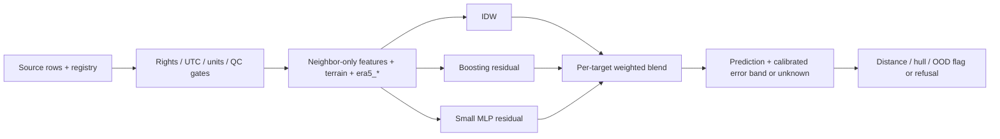

> Archived evidence / superseded guide. Original path: `reports/nwic_pipeline/INDIA_REPORT.md`. Protocol-specific results are preserved; use [PROJECT_OVERVIEW.md](../../../PROJECT_OVERVIEW.md) for current scope.

# India extension — measured results and remaining work

**Implemented and tested; not deployment-ready.** This is a bounded 2024 national archive experiment, not full-history/all-source training or validated 1–20 km mesh inference. Plan: [INDIA_PLAN.md](INDIA_PLAN.md). Separate patches: [patches](../../../../reports/nwic_pipeline/patches).

## Verified data and implementation

- Screened **all 586 ISO-IN NOAA GHCNh catalogue candidates** and the complete historical report inventory; downloaded/read **375 2024 station files**. Valid T/RH at 375, station pressure at 195, wind at 373. [Per-station years, variables, unique-hour completeness](../../../../reports/nwic_pipeline/noaa_station_coverage.csv); [raw-file hashes and full inventory receipt](../../../../data/noaa_ghcnh/coverage.json). Inventory report counts are not hourly completeness; actual historical hourly/variable completeness beyond 2024 is **not measured**.
- Registry: [India stations](../../../../data/registry/india_stations.csv), [NWIC stations](../../../../data/registry/nwic_stations.csv). Sampled SRTM elevation/slope at **558/586** NOAA candidates, all **30/30** NWIC sites; missing terrain stays unresolved. Climate classifications and missing pixels are explicit. Source coordinates are not a verified survey. MALE ISLAND is incorrectly India-coded and excluded; exact-coordinate aliases are merged, nearby/WMO/ICAO aliases/relocations still need verification.
- Long schema, source/row SHA256 lineage, canonical units, UTC intervals, pressure references, QC, separate **open / restricted-license** target views and modeled-background view: `ml/datasets/schema.sql:1`, `registry.py:14`, `adapters.py:28`. Non-commercial data never enters open training; unresolved licenses/time/pressure never enter target views. NOAA approved sample: **111,323 long rows / 33,636 station-time rows**, deterministic UTC hours 00/06/12/18 on days 1/8/15/22, 2024. Raw files remain intact. [Manifest](../../../../data/india_training/manifest.json).
- Source-native adapters: NOAA, NWIC, PRSA CSV, CPCB/OpenCity CSV, user-acquired OpenAQ v3 measurements; explicit-column export adapters for IMD/Sensor.Community. POWER modeled background and local ERA5-Land NetCDF adapters. Only NOAA/NWIC/POWER paths have real-data execution evidence; other adapters and provider response variations are **unverified**. Rainfall/legacy-temperature/CAMS export contracts remain partial; no rainfall is fabricated as a core target.

## NWIC evidence and quarantine

All **1,571,295** supplied rows are retained in the compressed long-form Parquet artifact, **zero approved training rows**. [Build receipt](../../../../data/nwic_himachal/build_report.json), [catalogue evidence](../../../../reports/nwic_pipeline/source_evidence/nwic_catalogue_receipt.json), [diagnostics](../../../../reports/nwic_pipeline/nwic_diagnostics.json).

- January daily temperature cycle nearest Mandi: POWER correlation **0.814 assuming IST**, **−0.579 assuming UTC**. Supports IST but does not prove timezone or instantaneous/interval semantics. Keep quarantined pending provider confirmation.
- Repeated 925 hPa is inconsistent across elevations. Bara Bhangal: **2,997/3,005 rows =925**, SRTM **2,510 m**, standard atmosphere approximately **746 hPa**; Arki: **1,962 m**, approximately **799 hPa**. Standard atmosphere is a diagnostic, not ERA5 or a correction. Kala Amb's supplied location samples at **5,069 m** despite median **964.6 hPa**: pressure and/or coordinates need provider investigation. **ERA5 surface-pressure comparison not performed**; POWER is grid-surface pressure, not station truth.
- The wind resource explicitly spans **1970–2025**; **11 rows dated 2007** are in the documented period but lack corroborating contemporaneous channels or correction evidence. They remain quarantined with the rest. No invented timestamp corrections.
- Hence an approved NWIC held-out-station evaluation is **blocked by unresolved source contracts**, not claimed as completed.

## Ensemble and transfer results

`ml/spatial_ensemble/model.py:85`: per-target IDW + small gradient boosting + 16/8-unit MLP residual heads, inverse-validation-MAE weights, separate calibration rows. Four core labels work directly; absent PM labels mask optional heads. Query sensors never enter features. `network.py:7` adds query elevation/slope, neighbor elevation, elevation difference, distance and separately named `era5_*`. Maximum distance, convex hull and fitted-envelope OOD checks include **per-channel valid nodes**; use `SpatialEnsemble(extended_features=True,max_distance_km=20)` for refusal. Diagnostic experiments deliberately permit flagged long-distance outputs and do not claim them as deployment-valid.

314 unique candidate sites entered the sample after geometry/terrain/climate screening. Train Jan–Aug, separate whole validation stations Sep–Oct, whole test stations Nov–Dec; 20 km buffer excludes nearby training/context sites, including aliases. Each experiment caps 2,500/600/1,000 rows; this is **not full national model training**. PM heads have no approved labels. Persistence is previous available **neighbor IDW within six hours**, not privileged hidden query-site history. Paired comparison uses rows finite for all baselines; per-method availability also reported. Validation halves follow deterministic station/time row order, not independent weather episodes. MAE CIs use 200 station bootstrap draws.

National 20 km-buffer scores, **MAE / RMSE**; ensemble MAE CI is 95% station bootstrap:

| Target | Ensemble | MAE CI | IDW | Nearest | Node mean | Neighbor persistence | Paired rows |
|---|---:|---:|---:|---:|---:|---:|---:|
| temperature_c (degC) | 1.94 / 3.30 | 1.41–2.61 | 2.38 / 3.79 | 2.47 / 3.68 | 2.79 / 4.31 | 4.76 / 6.31 | 800 |
| relative_humidity_pct (%) | 8.26 / 11.38 | 7.21–9.66 | 8.21 / 11.33 | 10.45 / 13.90 | 9.44 / 12.41 | 18.67 / 22.94 | 797 |
| pressure_hpa (hPa) | 23.79 / 55.80 | 9.63–47.19 | 35.67 / 65.12 | 35.35 / 63.02 | 41.32 / 67.19 | 35.24 / 65.55 | 348 |
| wind_speed_mps (m/s) | 0.88 / 1.16 | 0.74–1.02 | 0.88 / 1.18 | 1.02 / 1.46 | 0.84 / 1.10 | 1.10 / 1.40 | 802 |

**Losses matter:** national RH loses to IDW; wind loses to node mean. Himalaya proxy hold-out MAE T/RH/P/wind = **6.20 / 16.62 / 110.95 / 0.76**, versus IDW **7.77 / 14.62 / 124.32 / 0.67**; RH and wind lose, pressure is unacceptable. Leave-zone-out pressure in Cwa loses to node mean (54.22 vs 45.30 hPa); BWh/Cwb wind also loses. [Full MAE/RMSE/CIs, per-climate and elevation-band reports](../../../../reports/nwic_pipeline/india_evaluation.json). BWk/Cfa/Cfb/Dfb/Dwb have only 1–2 sample sites and cannot support required disjoint regional tests. “Himalaya” is explicitly a **western/central geographic proxy** (28–37 N,72–90 E, elevation >=500 m), not a verified complete Himalayan boundary; full eastern-Himalaya region hold-out remains unverified.

Short range: only **35/49,141 static candidate pairs (0.071%)** lie at 1–20 km; some may be unresolved aliases. Actual training-context distances in the main experiment: 1–5 km **94**, 5–20 km **250**, out of **80,000** context incidences (**0.43%** at 1–20 km, repeated over time). Dense independent city clusters are **not established**; CPCB/OpenAQ rights, clocks and coordinates need resolution. With the 5 km buffer only **76/1,000** test queries pass 20 km/hull geometry; serving-band coverage T/RH/P/wind = **73.7% / 77.6% / 100% / 65.3%**, on only **76/76/8/75** rows. Nominal 90% bands are not reliable. The 20 km-buffer test has zero valid 20 km serving-band rows by construction. Offline diagnostic validation-band coverage is separately labeled and must not be treated as safe serving uncertainty.

## Mandi comparison

Both ensembles use the **same seven observed context sites**, same held-out Mandi station and same eight Nov–Dec UTC reports. Core MAE:

| Model | T degC | RH % | P hPa | Wind m/s |
|---|---:|---:|---:|---:|
| National | 4.27 | 11.58 | 110.32 | 0.20 |
| Himalaya-only | 3.34 | 8.92 | 83.10 | 0.09 |

**Himalaya-specific wins this tiny matched archive comparison on all four channels.** Eight reports at one source site cannot establish a production winner or confidence interval. Pressure is still unusable; node mean beats both for RH and nearest node has zero wind error during these calm observations. NOAA Mandi is an archive-site proxy; own-node/NWIC validation remains absent.

## Missing access, coverage and next steps

- **CDS / ERA5-Land:** user account, accepted dataset terms and personal access token or manual NetCDF download required. [Official instructions](https://cds.climate.copernicus.eu/how-to-api), [monthly India + Mandi request files](../../../../data/registry/cds_requests.json). No authentication bypass attempted. Request receipt/NetCDF adapter are implemented; actual downloads, latency and trained `era5_*` contribution are unverified.
- **OpenAQ:** v3 API key and per-provider license/coordinates required; no data obtained through its authenticated API. [Official API](https://docs.openaq.org/api). **IMD:** request/export via [data supply portal](https://dsp.imdpune.gov.in/), verify terms/timestamps/reference; no new national station observations obtained. No credentials requested or logged.
- Existing CPCB non-commercial compilation stays restricted; Delhi/OpenCity time/rights/site contracts, Sensor.Community historical coverage/rights, CAMS/download terms, legacy NWIC and rainfall alignment remain unresolved or unacquired. UCI is Chinese and does not establish Indian spatial coverage. POWER obtained only for January Mandi diagnostics; no nationwide POWER training. NOAA is [public CC0 GHCNh](https://registry.opendata.aws/noaa-ghcnh/), hourly/synoptic; [SRTM GL1 v3](https://portal.opentopography.org/raster?opentopoID=OTSRTM.082015.4326.1) is 30 m terrain; [Köppen-Geiger](https://www.gloh2o.org/koppen/) is 1 km 1991–2020 climate classification, CC-BY-4.0. ERA5-Land is hourly ~9 km background, not station truth.
- Poorly supported: alpine/cold-desert sites, eastern Himalaya and other sparse highlands, desert pressure, independent dense-city meshes, PM in every region, and nearly all 1–20 km interpolation. [Catalogue/sample climate counts and caveats](../../../../reports/nwic_pipeline/coverage_summary.json), [1-degree station coverage cells](../../../../reports/nwic_pipeline/coverage_cells.csv); these are source coverage, not a claim that India has no instruments in empty cells.

**Quick wins:** provider-confirm NWIC clocks/reference/coordinate conflicts; resolve nearby aliases; obtain CDS exports and OpenAQ/IMD contracts; expand actual unique-hour/variable audit to all historical years; recalibrate on whole weather episodes; explicitly model flatline/uptime reliability and actual data publication latency. **Larger work:** independent urban/valley 1–20 km reference campaigns, full historical national training, official climate/Himalayan polygons, elevation-adjusted pressure physics baseline, dense-city PM heads, safe versioned model export and ESP32 distillation/quantization. The Python ensemble runs on a server; this change adds no ESP32 deployment artifact or board-level validation. [Own-node collection specification](../../../../reports/nwic_pipeline/NODE_COLLECTION_SPEC.md).

Validation: **67 tests pass** in the isolated Python environment, including masked core-only fitting, malformed/stale nodes, target-specific distance refusal, missing/QC source rows, modeled-vs-target isolation and finite-value checks. Firmware validation remains the prior review's compile-only evidence; no board testing. Download jobs use bounded caches; partial artifacts are quarantined/atomically replaced. Generic/non-NOAA adapters remain unverified on provider exports.
