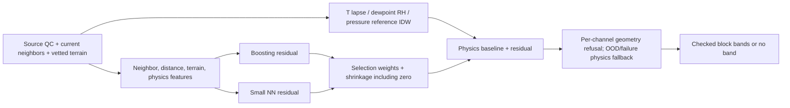

# Physics phase — measured results and remaining risks

Implemented as separate review patches; original plans are in [PLAN.md](PLAN.md). Full scores, RMSE, station-bootstrap MAE intervals, coverage and losses: [practicum results](../practicum/RESULTS.md), [machine-readable experiments](results.json). No production or ESP32 deployment claim. Tested Python 3.11.8/package versions are pinned separately in `requirements-physics.txt`; the older root pins differ.

## Findings ranked by severity

**High — uncertainty still fails under regional/seasonal shift.** The legacy unchecked p90 serving output is disabled (`ml/spatial_ensemble/model.py:214`). New block calibration uses global 72-hour UTC blocks, not independently sampled rows (`episodes.py:15`, `:47`). Calibration Sep–Oct, independent check Nov, untouched audit Dec; all sites in a block share the fold. Failed check/audit or sparse target-distance bins withhold bands. Himalayan pressure trial bands fail: episode coverage is **20% at 50–100 km and 0% at 100–250/250+ km** at both trial 80/90 levels; corresponding trial-90 point coverage is 84.5%, 51.3%, 25.5%. All Himalayan pressure bands are revoked. Calendar blocks approximate episodes; dependence/exchangeability is unverified. No future nominal coverage guarantee.

**High — residuals and humidity do not consistently win.** Selection-only shrinkage allows zero correction, but cannot ensure smaller error on unknown future truth (`physics_residual.py:36`). Himalayan residual pressure **18.915** loses to physics **18.738 hPa**; national RH **10.887 percentage points** loses to RH IDW **8.889**; Himalayan RH **21.572** loses to IDW **14.920**. National wind **0.940 m/s** loses to IDW **0.919** and mean **0.872**. These losses are retained in every output.

**High — archive skill is mostly outside mesh serving range.** 20 km buffered national and Himalayan tests have **zero** rows eligible for the current 20 km + per-channel hull serving policy. With a 5 km buffer, eligibility is T 617 rows/9 stations (MAE 0.759°C), RH 616/9 (7.544 pp), pressure 131/**one** station (0.256 hPa), wind 626/9 (0.872 m/s). These small subsets do not establish general 1–20 km mesh performance. Nearby undocumented aliases may remain. The Himalayan hold-out is the existing latitude/longitude/elevation proxy (28–37°N, 72–90°E, SRTM ≥500 m), not a verified complete ecological Himalaya boundary.

**Medium — suspect elevation/pressure is quarantined, not repaired.** All 375 NOAA source stations screened: 27 lose pressure eligibility (19 missing SRTM, eight >250 m catalogue/SRTM disagreements; two also fail prior pressure plausibility). Flags and evidence are in [station_qc.csv](../../data/physics_training/station_qc.csv). Exact-coordinate alias `INM00043291` is removed, leaving 374 sites. QC uses observations before July 2024 and fixed thresholds, not test residuals (`hourly_noaa.py:70`). Flags do not establish which height is correct and may exclude valid terrain differences. NWIC Kala Amb remains quarantined: supplied coordinate SRTM ≈5069 m and median pressure ≈964.6 hPa conflict; source location/clock/reference/licensing still unresolved. Its data never enter these NOAA fits. Pressure reduction also rejects implausible reference pressure at each snapshot.

**Medium — ERA5 and embedded execution are unverified.** No ERA5 files found; background slots are missing, excluded from active fitted features, and have no measured contribution. [Exact authenticated/manual download requirements](ERA5_DOWNLOAD.md). New models stay in server memory; no exported/distilled/quantized ESP32 artifact or measured RAM/flash/watchdog timing. The existing firmware was not changed in this phase. Small NN iteration budget/convergence and model tuning remain limitations.

## Pressure results (hPa MAE, same QC-valid paired rows)

| Hold-out / training | Rows / stations | Residual | Physics | Raw IDW | Nearest | Node mean |
|---|---:|---:|---:|---:|---:|---:|
| National 20 km, 2023+2024 | 2688 / 31 | 5.829 | 5.829 | 49.156 | 52.970 | 52.733 |
| National 5 km, 2023+2024 | 2688 / 31 | 3.586 | 3.586 | 37.950 | 34.982 | 49.472 |
| Himalaya 20 km, 2023+2024 | 1238 / 8 | **18.915** | **18.738** | 114.793 | 119.306 | 112.864 |

Residual pressure station-bootstrap 95% MAE intervals: national 20 km **[3.377, 9.558]**, national 5 km **[2.021, 5.639]**, Himalaya **[5.763, 43.898]**. They are descriptive, not a paired significance test. One-hour neighbor persistence has no valid pressure pairs in these tests. Exact 3-hour **physics** persistence is available on a separate subset: national 20 km 2679 rows/5.692 hPa; Himalaya 1235/18.584. Separate denominators prevent a claimed paired win. Earlier phase pressure scores used a different, unfiltered/sample-time protocol and are not directly comparable.

## More rows / extra year (identical complete December test)

All 735 acquired station-year files read: 375 in 2024, 360 in 2023; other 15 have no 2023 file. **1,516,003** hour buckets retained, including **775,778** calendar-2024 hour-end buckets; no manufactured missing hours. Every hourly row has `source_id` and `location_id`; raw-row/hash lineage is retained separately. Hour means close at UTC hour-end; archive publication latency is unknown. Whole station hold-outs/buffers and chronological blocks mean not all stations/hours can be training labels in a leakage-safe evaluation.

| Fit / selection rows | T MAE °C | RH MAE pp | P MAE hPa | Wind MAE m/s |
|---|---:|---:|---:|---:|
| Capped 2500 / 600; complete test | 1.867 | 11.026 | **5.597** | **0.930** |
| 2024: 230102 / 18618 | **1.824** | 10.909 | 5.829 | 0.957 |
| 2023+2024: 655962 / 18618 | 1.867 | **10.887** | 5.829 | 0.940 |

Test has 12,604 rows before per-target masks. More data is not a uniform improvement. Original 1000-test cap also retained as a sensitivity run. National 5 km fits 693,632 rows; Himalayan hold-out fits 770,877. Station splits and all counts are versioned in `results.json`.

## Baselines / ensemble / checked bands

[Physics](../../ml/spatial_ensemble/physics.py): fixed 6.5 K/km T lapse → interpolate common-height T → restore query height. RH: interpolate native QC dewpoint (otherwise derive from T/RH) → recover RH at adjusted query T. P: hydrostatic ideal-gas constant-lapse reference transform with optional virtual temperature; missing T uses an explicit ISA approximation → IDW **log reference pressure at 0 m EGM96** → restore at query elevation/T/RH. This is not official MSLP; high terrain/below-ground extrapolation is uncertain. Missing query height refuses pressure. Physics values/deltas/reference P/dewpoint are separate ensemble features.

Full 80/90 trial coverage vs distance, widths and episode counts are in [coverage_by_distance.csv](../practicum/coverage_by_distance.csv). At 5–20 km in the 5 km buffered run: T trial 80/90 episode coverage **100/100%** (754 rows, 10 blocks); RH **80/80%** (751; 90 revoked); P **90/100%** (131, one station); wind **80/90%** (763; 80 failed November check). T trial-90 width ±12.64°C illustrates how weak/usefully wide block-max bands can be. No 0–5 km evidence. Archive-approved bins beyond 20 km still cannot pass serving geometry; OOD/failure serving branches withhold bands.

## Verified / unverified and next priorities

**Verified:** full-hour ingestion/rerun with input hashes; station/episode separation assertions; baseline round trips and synthetic physics; selection aggregate non-inferiority check; masked PM, model failure/OOD fallback, pressure/elevation rejection, coordinate/dewpoint QC, query-truth feature independence, snapshot/batch feature parity, unchecked-band suppression and audit revocation. **87 tests passed plus eight subtests**, one existing pandas deprecation warning. Figures rendered and inspected; demo executed. Small patch syntax/round-trip checks recorded in `verification.json`.

**Unverified:** source clocks/reference/rights for NWIC; true meteorological episode independence; live publication latency; national dense-mesh/general Himalayan uncertainty coverage; PM learning; ERA5 improvement; NN convergence/tuning; distilled model export, ESP32 runtime and live security/field reliability. No systematic patent prior-art search: [evidence-only invention notes](../../INVENTION_NOTES.md).

Quick wins: prefer raw RH IDW until a disjoint validation regime supports a humidity correction; manually resolve flagged site heights; preserve band refusal and a no-learning physics mode. Larger work: local lapse/moisture models with inversion/season features, real dense node data and regional calibration, actual ERA5 join/ablation after authorized downloads, then model export/distillation and device measurements. Do not promote the residual model or nominal bands on December-driven retuning without another untouched evaluation.
