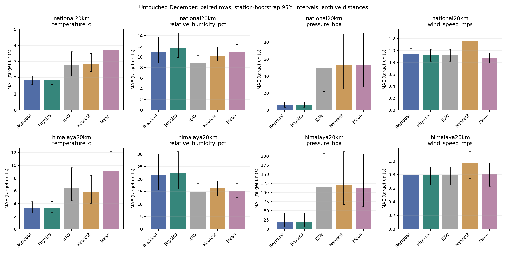
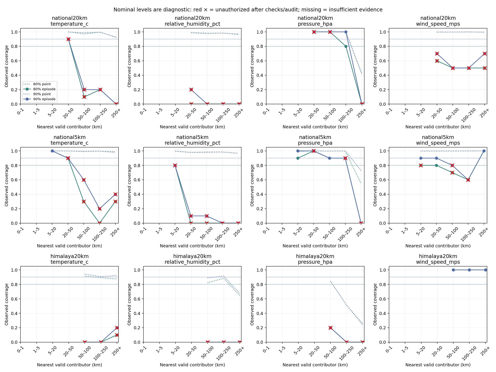

> Scope: historical source/experiment reference. Statements about mandatory six inputs apply to the older forecast, not the current four-core-channel spatial task. See [current overview](../../docs/PROJECT_OVERVIEW.md). This file does not establish two-node deployment skill.

# Practicum measured results

NOAA-only completed-hour interpolation. All results below use whole held-out stations and a spatial buffer. December 2024 is untouched for fitting, shrinkage and interval widths. **Archive diagnostic distances often exceed the 20 km serving limit**; these tables do not demonstrate deployable 1–20 km mesh skill. CIs resample whole stations (200 bootstrap repetitions), not individual hours; they do not quantify all spatial/temporal dependence.

| Scope / training | Target | Rows | Residual MAE | Physics MAE | IDW MAE | Nearest MAE | Mean MAE | Residual loses to |
|---|---|---:|---:|---:|---:|---:|---:|---|
| national20km / capped2024 | temperature_c | 993 | 1.934 | 1.934 | 2.891 | 2.995 | 3.897 | none |
| national20km / capped2024 | relative_humidity_pct | 990 | 11.277 | 12.034 | 9.019 | 10.461 | 10.695 | idw, nearest_node, node_mean |
| national20km / capped2024 | pressure_hpa | 201 | 6.370 | 6.537 | 54.231 | 57.473 | 57.802 | none |
| national20km / capped2024 | wind_speed_mps | 979 | 0.902 | 0.887 | 0.887 | 1.140 | 0.862 | physics_baseline, idw, node_mean |
| national20km / capped2024_full_test | temperature_c | 12525 | 1.867 | 1.867 | 2.765 | 2.873 | 3.739 | none |
| national20km / capped2024_full_test | relative_humidity_pct | 12513 | 11.026 | 11.749 | 8.889 | 10.249 | 10.989 | idw, nearest_node, node_mean |
| national20km / capped2024_full_test | pressure_hpa | 2688 | 5.597 | 5.829 | 49.156 | 52.970 | 52.733 | none |
| national20km / capped2024_full_test | wind_speed_mps | 12420 | 0.930 | 0.919 | 0.919 | 1.162 | 0.872 | physics_baseline, idw, node_mean |
| national20km / all_hours2024 | temperature_c | 12525 | 1.824 | 1.867 | 2.765 | 2.873 | 3.739 | none |
| national20km / all_hours2024 | relative_humidity_pct | 12513 | 10.909 | 11.749 | 8.889 | 10.249 | 10.989 | idw, nearest_node |
| national20km / all_hours2024 | pressure_hpa | 2688 | 5.829 | 5.829 | 49.156 | 52.970 | 52.733 | none |
| national20km / all_hours2024 | wind_speed_mps | 12420 | 0.957 | 0.919 | 0.919 | 1.162 | 0.872 | physics_baseline, idw, node_mean |
| national20km / all_hours2023_2024 | temperature_c | 12525 | 1.867 | 1.867 | 2.765 | 2.873 | 3.739 | none |
| national20km / all_hours2023_2024 | relative_humidity_pct | 12513 | 10.887 | 11.749 | 8.889 | 10.249 | 10.989 | idw, nearest_node |
| national20km / all_hours2023_2024 | pressure_hpa | 2688 | 5.829 | 5.829 | 49.156 | 52.970 | 52.733 | none |
| national20km / all_hours2023_2024 | wind_speed_mps | 12420 | 0.940 | 0.919 | 0.919 | 1.162 | 0.872 | physics_baseline, idw, node_mean |
| national5km / all_hours2023_2024 | temperature_c | 12525 | 1.656 | 1.681 | 2.094 | 2.285 | 3.537 | none |
| national5km / all_hours2023_2024 | relative_humidity_pct | 12513 | 9.472 | 10.130 | 8.760 | 10.199 | 10.761 | idw |
| national5km / all_hours2023_2024 | pressure_hpa | 2688 | 3.586 | 3.586 | 37.950 | 34.982 | 49.472 | none |
| national5km / all_hours2023_2024 | wind_speed_mps | 12420 | 0.957 | 0.876 | 0.876 | 1.065 | 0.851 | physics_baseline, idw, node_mean |
| himalaya20km / all_hours2023_2024 | temperature_c | 2592 | 3.277 | 3.305 | 6.495 | 5.763 | 9.159 | none |
| himalaya20km / all_hours2023_2024 | relative_humidity_pct | 2581 | 21.572 | 22.300 | 14.920 | 16.313 | 15.323 | idw, nearest_node, node_mean |
| himalaya20km / all_hours2023_2024 | pressure_hpa | 1238 | 18.915 | 18.738 | 114.793 | 119.306 | 112.864 | physics_baseline |
| himalaya20km / all_hours2023_2024 | wind_speed_mps | 2618 | 0.791 | 0.791 | 0.791 | 0.974 | 0.809 | none |

RMSE, station-bootstrap MAE intervals, sample counts and unavailable persistence are in [results.csv](results.csv). Per-climate/elevation metrics and station IDs are in [results.json](../physics_phase/results.json). PM heads have no training observations and remain unavailable.

## Interpretation and limitations

- Pressure physics uses 0 m EGM96 reference pressure, log-space IDW and query-height restoration. Station/QC filtering changes the population; compare only the paired rows here, not the previous unfiltered pressure score.
- T uses a fixed 6.5 K/km lapse. Inversions, valleys and seasonal lapse changes remain unresolved. RH uses dewpoint interpolation followed by query-temperature reconstruction; raw RH IDW can win. Wind retains IDW as its physics baseline.
- The residual shrinkage is non-inferior only on July–August selection aggregate MAE. December losses are listed explicitly. No future/pointwise “never worse” claim.
- Global 72-hour UTC blocks keep all stations in the same temporal role. They approximate weather episodes; storms can cross block boundaries. Train: 2023 plus Jan–Jun 2024; select: Jul–Aug; calibrate: Sep–Oct; independent check: Nov; final audit: Dec. Episode **start** assigns the fold, so an episode can cross a month/year boundary.
- The block-max conformal width targets simultaneous coverage of all observed rows in each target/distance bin per episode. Calibration/check weather may differ from test weather; finite-episode evidence is weak and widths can be large. Both point and episode coverage, widths and approximate binomial episode intervals are in [coverage_by_distance.csv](coverage_by_distance.csv). These intervals assume independent episodes and are descriptive only.
- A failed November check or December audit revokes interval authorization without retuning widths on December. Sparse bins have no interval. Archived coverages remain visible as diagnostics, including failures. Geometry refusal and OOD/failure fallback never expose a checked serving band in the demo.
- All 375 source-station files are screened; exact coordinate aliases and suspect P/elevation channels are excluded. Not every station reports every hour or pressure. No missing hours are manufactured. Hourly means are not instantaneous sensor truth, and archive publication latency is unverified.
- ERA5-Land was absent; no background contribution was measured. [Exact downloads](../physics_phase/ERA5_DOWNLOAD.md). NWIC/Kala Amb remain quarantined. These runs do not train PM heads or establish the national versus Himalaya-specialist Mandi comparison anew.
- The new full ensemble is a Python server experiment. No deployable model artifact, ESP32 distillation, device memory/latency/energy or field outage test is established.

## Demonstration

The current demo is the two-node interface: run `python -m reports.practicum.demo --input readings.json`, optionally with `--model data/two_node_training/national5km/k2/model.json`. Input contains A/B readings and query coordinates/elevation/time; hidden readings are forbidden. No-input mode uses explicitly synthetic A/B data. Predictions, checked bands (otherwise null), corridor distances and status are printed. See [two-node report](../two_node_phase/REPORT.md) and [recorded physics demo](demo_output.json). The historical archive tables below retain the earlier 32-neighbor protocol.

Reproduce: `python -m ml.datasets.hourly_noaa --acquire-year 2023` (unsigned public NOAA download), `python -m ml.datasets.hourly_noaa`, `python -m ml.spatial_ensemble.evaluate_physics`, `python -m ml.spatial_ensemble.finalize_physics`, `python -m reports.practicum.build_outputs`. Use an isolated Python 3.11.8 environment with `requirements-physics.txt` (the root pins differ from this tested phase) and the same raw-file hashes. The capped/full-test comparison uses identical final test rows.

## Figures

