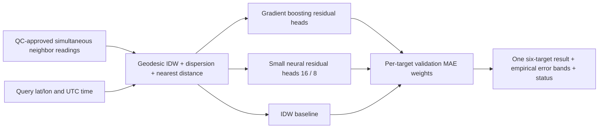

# Focused review — 3 October 2026

**Verdict: a tested node-forecast research prototype, not yet a validated, deployable weather mesh interpolator.** Small fixes and an isolated experimental ensemble are in the working tree; saved models and deployment selection are unchanged. No commits were created. Dataset access, the full ingestion pipeline and field validation remain larger work.

## Findings by severity

| Severity | Finding / evidence | Action |
|---|---|---|
| **Critical — release blocker** | Existing models explicitly exclude GPS/time/station features (`ml/six_sensor_forecast/train.py:97`). Geographic tests still feed the held-out station's own six readings (`predict.py:28`). `midpoint.py:82` averages endpoints before forecasting. These do not prove predictions between nodes. | New neighbor-only spatial ensemble/evaluator added separately. Real six-target interpolation MAE/RMSE remain **unverified**, requiring independently measured withheld nodes and verified coordinates. |
| **High** | No approved six-channel Mandi training/validation dataset. Indian pressure units/reference and some timezones unresolved; Himachal lacks PM and shows repeated pressure artifacts. UCI weather is nearest-meteorological-station matched (`data.py:105`), potentially shared across pollution sites. | Quarantine unresolved data; verify physical site/met-station identities and blocked splits. See dataset inventory/pipeline. |
| **High** | Event outputs imitate rules generated from input sensors (`ml/event_classifier/features.py:156`); two heads untrained, no independent hazard validation. Heatmaps interpolate these scores (`heatmap.py:199,217`). | Do not interpret as calibrated hazards or six-hour event forecasts. Acquire independent labels and calibration evidence. |
| **High — fixed** | Hourly reindexing could expand two observations separated by centuries into huge allocations (`six_sensor_forecast/features.py:57`, `event_classifier/features.py:103`, `event_classifier/predict.py:63`). Naive timestamps were silently treated as UTC. | Shared validator now rejects naive/missing times and bounds station/total hourly expansion (`features.py:20–40`); regression tests cover both model pipelines. Quotas are offline limits, not a production API memory budget. |
| **High — integration gap** | No LoRa mesh, live sensor drivers or network API in reviewed deployment. Serial CSV/RESET are unauthenticated (`esp32/ml_integration/src/main.cpp:75,92`); INFO hashes identify a build but do not authenticate senders. Spoofed plausible measurements would be accepted. | Add per-node authenticated messages, counters/boot epochs, freshness/replay protection, key provisioning/rotation and authenticated server ingestion before radio/API rollout. No nonexistent network endpoint was labelled vulnerable. |
| **Medium — fixed** | Initially 3/50 tests failed during model export: installed pandas/XGBoost combination discarded inferred feature names. | Explicit feature names on training/prediction matrices (`train.py:136,190`); all export/parity tests now pass. Tested installed versions differ from requirements pins. |
| **Medium — fixed / residual risk** | Embedded NUL could truncate serial input into a valid command; unbounded serial draining could starve loop yielding (`main.cpp:113`). | Reject control/non-ASCII bytes; drain at most 256 bytes per loop. Host tests execute actual receiver with a shim. Serial printing and SELFTEST can still block; watchdog stress on hardware remains unverified. |
| **Medium** | Original forecast batch reloads six models each call, aborts on any artifact failure (`predict.py:49–55`), emits no uncertainty despite stored validation error bands, and requires all current channels. Firmware rejects a faulty snapshot entirely (`indra_ml_runtime.h:43–48`). Broad physical ranges cannot detect plausible wrong units or frozen sensors. | New ensemble isolates model failures, has per-target missing-node fallback and OOD checks. Original node path still needs a cached predictor, freshness/stuck/spike QC and separately validated fallback. |
| **Low** | Four direct Python pins and seeded/versioned reports exist, but transitive dependencies, lint tools/actions and artifact authenticity are not fully locked. Checksums detect accidental changes, not an attacker replacing report and models together. | Lock full tested environment; signed/immutable release manifest; CI dependency scans. OSV returned no advisories for 9 inspected installed runtime packages and 4 requirement pins; this is not a full Python/Arduino/transitive audit. |

No unsafe pickle/joblib loading, `eval` of user payloads, or hardcoded credentials were found in scanned Python/C++/header sources. Models use checked UBJ artifacts. Secret scanning did not include Git history or every raw response; malformed CLI/file inputs are not a hardened public service boundary.

## What exists

Six measurement channels (not necessarily six physical devices): **T °C, RH %, station pressure hPa, PM2.5 µg/m³, PM10 µg/m³, wind m/s** (`contract.py:3–19`). Each has a current input and same-variable six-hour target. Every channel supplies lags 1/3/6/12/24 h, one-hour delta, trailing 6/24-hour mean/std: **66 teacher features** (`features.py:61`). The compact student takes six current channels only. UCI RH is derived from T/dewpoint, not a directly measured RH channel.

Pipeline: pinned/hash-checked UCI download → timezone/unit adapter → causal hourly features/exact keyed future labels → geographic plus future-time splits with label-horizon purge → six residual XGBoost teachers, depth/weight selection → six 16-tree/depth-3 distilled XGBoost students → UBJ reports → bounded C99 inference with host parity. Inference is current value plus weighted predicted residual, physically clipped. Indian five-/two-channel experimental families and paired comparisons also exist.

The separate event path has **17 features**: six raw plus dewpoint, vapor-pressure deficit, heat index, PM2.5/PM10 ratio, pressure deltas 1/6 h, T/PM2.5/PM10/RH one-hour deltas and six-hour PM monotonicity (`event_classifier/features.py:45`). Firmware stores seven hourly snapshots for these. Optional kriging with IDW fallback builds planar, support-masked heatmaps; PyKrige is not a required installed dependency. Latitude/longitude locate the midpoint only; heatmap x/y require a common local projection. **Elevation, terrain, learned geographic distances and cyclical time are absent from saved models.**

Working: model training/export tests, artifact checks, host Python/C parity, chronological/held-out-station splits, gap/duplicate handling, serial replay/recording and field-evaluation tooling. Partial: midpoint/heatmaps, event-rule evidence, Indian data adaptation and calibration interfaces. Missing: field-proven six-target spatial model, complete verified local data, live sensor/radio integration, authenticated transport, production ingestion/service, on-device latency/power/outage measurements.

## New ensemble (implemented, experimental server library)

`ml/spatial_ensemble/model.py:29,89,134`: 25 neighbor/context features, six independently fitted heads. Latitude/longitude use spherical embedding and haversine distances; UTC hour/year use sine/cosine. Histogram gradient boosting and scaled small MLP learn corrections to IDW. Inverse validation-MAE weights are simpler to inspect and less data-hungry than a stacking meta-model. A separate later validation half estimates the 90th-percentile absolute-error band. This is an empirical interval, **not guaranteed 90% coverage**, particularly with correlated stations/times.

Exceptions/nonfinite model outputs remove that member and renormalize weights. Invalid/stale nodes and channels are excluded; colocated values are averaged; one surviving node yields a labelled degraded estimate. No valid observations → null/UNAVAILABLE. OOD envelope or incomplete features fall back to IDW. Degraded output has unknown uncertainty rather than fabricated confidence. This fallback is a bounded research estimate, not a certified safe hazard decision. Maximum supported radius, convex-hull/elevation checks and stuck-sensor QC remain release requirements. Fit-time model failures are recorded.

`evaluate.py:25,50` hides query readings, uses only training-node context, reserves entire validation/test stations and later time blocks, rejects split overlap/colocated cross-split aliases, and reports paired per-target MAE/RMSE vs IDW/nearest/mean. It does not implement geographic buffer splits, terrain adapters, complete model persistence or a service. Models remain in memory; no new unsafe deserialization is introduced. Extending this current-time interpolator to six-hour mesh forecasts needs separately labelled/evaluated neighbor-history training.

## Evaluation evidence

**Saved results, read from `ml/models/uci_beijing_6h/training_report.json`; not retrained/re-scored on the full dataset during this review.** Geographic test at Changping/Dingling/Huairou, six-hour node forecasts; entries are MAE / RMSE in each target's units:

| Target | Persistence | Teacher | ESP32 student |
|---|---:|---:|---:|
| Temperature | 3.869 / 4.829 | 2.025 / 2.605 | 3.525 / 4.154 |
| RH | 15.248 / 19.481 | 9.625 / 12.798 | 13.974 / 16.905 |
| Pressure | 1.843 / 2.393 | 1.306 / 1.738 | 1.784 / 2.297 |
| PM2.5 | 26.887 / 48.089 | 25.844 / 44.128 | 26.243 / 45.358 |
| PM10 | 35.144 / 58.077 | 33.457 / 52.749 | 34.328 / 54.436 |
| Wind | 0.924 / 1.318 | 0.697 / 0.990 | 0.746 / 1.059 |

**New synthetic harness run ONLY — not weather accuracy evidence.** Four context stations, separate interior validation/test nodes and later time blocks; 50 test rows/target. MAE/RMSE:

| Target | Ensemble | IDW | Nearest node | Node mean |
|---|---:|---:|---:|---:|
| Temperature | .067/.087 | .071/.092 | .094/.112 | .077/.092 |
| RH | .339/.388 | .313/.357 | .367/.431 | .309/.354 |
| Pressure | .090/.106 | .091/.108 | .105/.127 | .095/.111 |
| PM2.5 | .459/.588 | .461/.605 | .614/.775 | .446/.587 |
| PM10 | .605/.755 | .561/.719 | .781/.959 | .572/.712 |
| Wind | .046/.054 | .040/.050 | .048/.059 | .041/.052 |

Ensemble does **not** beat IDW on every synthetic target; no accuracy superiority is claimed. Synthetic band coverage ranges 86–96%. Full outputs: `synthetic_metrics.json`; reproduce with `python -m reports.review.run_synthetic_evaluation`. Real between-node metrics cannot responsibly be produced without a frozen coordinate-verified six-target dataset; the evaluator is ready for that input.

## ESP32 / verification

Ran all **56 tests, passing** (original 50 plus 6 new), including model training, regenerated C export, Python/C runtime parity, NaN/inf/ranges, missing/gapped readings, duplicate/out-of-order times, station splits, model tampering and serial receiver. New tests cover naive/century-spanning time inputs, invalid geographic coordinates, colocated/offline nodes, wrong Pa units, missing targets, failing/nonfinite models and query-label exclusion. Existing heatmaps intentionally reject duplicate positions or fewer than two nodes; new ensemble degrades rather than crashing on an outage. Frozen plausible readings are still accepted: automated stuck-sensor detection is **missing**, not proven fixed.

Fresh PlatformIO builds passed:

| ESP32-S3 build | Flash | Static RAM |
|---|---:|---:|
| UART | 316,853 B | 18,848 B |
| Native USB | 314,101 B | 19,080 B |

Board target: 240 MHz, 320 KiB RAM, 8 MiB flash; application limit ~3.34 MB. Forecast export has 96 trees, depth ≤3, 1,438 nodes, ~66.6 KB C source; runtime uses fixed buffers (~168 B history, 192 B serial line) and no dynamic inference allocation. Double intermediates aid event-feature parity, forecasts use float32, timestamp addition uses uint64; uint32 input timestamps stop in 2106. Serial output/boot delay can block; no heap leak observed in portable runtime, but board/framework behavior is unverified. No hardware flash, long soak, latency, stack high-water, radio coexistence or watchdog stress was run.

**Split recommendation:** full Python ensemble on gateway/server; ESP32 samples/QCs/authenticates readings and runs retained compact local forecast/offline fallback. For on-device spatial inference, distill neighbor-based ensemble into a separately trained/exported compact tree model (existing C exporter) or int8 MLP/TFLite Micro, with fixed neighbor count and feature/schema parity. An illustrative 25→16→8→6 MLP has 606 weights/biases (~606 B int8 or 2,424 B float), excluding runtime/scales/activation arena. No distilled spatial model or quantization has been implemented/benchmarked; measured old firmware fit is not evidence the full sklearn ensemble fits ESP32.

Test environment: Python 3.11.8, NumPy 2.3.4, pandas 3.0.3, sklearn 1.7.2, XGBoost 3.1.1. Exact requirements environment was not installed. OSV query receipts are in `dependency_audit.json`; no returned advisories, limited scope. Ruff unavailable; changed Python sources passed AST syntax checks. A broad compileall/Git check stalled in this environment; no completion is claimed. No claim of full vulnerability clearance.

## Prioritized roadmap

**Quick wins:** (1) Review/apply separate patches; retain passing CI/parity and exact environment lock. (2) Confirm source timezone, pressure reference, station coordinates/aliases and licenses; quarantine ambiguity. (3) Add sensor QC flags for freeze/spikes/staleness, explicit unit contract and conservative OOD/offline handling to original node inference. (4) Cache verified node predictors and expose empirically calibrated uncertainty. (5) Enforce signed artifact releases and message authentication when transport is introduced.

**Larger changes:** (1) Build ALL-source versioned store with observed/modeled provenance and missing-target views using [the dataset/pipeline design](DATASETS_AND_PIPELINE.md). (2) Collect colocated six-channel ground truth in Mandi, reserve unseen interior nodes and spatial/time buffers; compare ensemble vs IDW before claiming spatial skill. (3) Add DEM/elevation, wind transport and background residual views; spatial-block tuning and independent interval calibration. (4) Implement/measure authenticated LoRa delivery, outage recovery and field firmware soak. (5) Distill spatial model, validate float/int8 parity and error, then release with measured RAM/flash/latency and independent accuracy evidence.

Small review patches: `patches/01-observation-validation.patch`, `02-feature-names.patch`, `03-serial-receiver.patch`. Experimental ensemble/tests: `04-spatial-ensemble.patch`. These export the working-tree changes; **do not reapply to this already modified checkout**.
