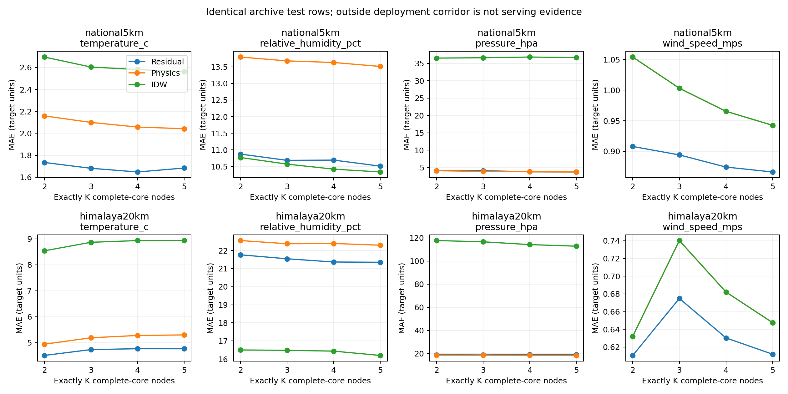

# Exactly two nodes: measured archive results

**Deployment coverage remains unverified.** Each fit/prediction uses exactly K distinct QC-valid core-weather neighbors; K=2 is a separately trained model, with 3/4/5 comparisons. Complete-core contexts require T/RH/station pressure/wind, vetted height and plausible reduced pressure. This differs from the previous partial-channel 32-neighbor cohort. No row caps; all previously acquired 2023/2024 hours are considered. Exact coordinate aliases and held-out physical sites are excluded. Query labels never enter features.

## Identical test-row comparison (archive diagnostics)

| Hold-out | K | Fit rows | Common test rows | T MAE °C | RH MAE pp | P MAE hPa | Wind MAE m/s |
|---|---:|---:|---:|---:|---:|---:|---:|
| national5km | 2 | 462227 | 8391 | 1.735 | 10.871 | 4.059 | 0.908 |
| national5km | 3 | 462209 | 8391 | 1.681 | 10.682 | 4.065 | 0.894 |
| national5km | 4 | 462203 | 8391 | 1.648 | 10.690 | 3.752 | 0.874 |
| national5km | 5 | 462203 | 8391 | 1.684 | 10.508 | 3.699 | 0.866 |
| himalaya20km | 2 | 541231 | 1904 | 4.507 | 21.763 | 18.945 | 0.611 |
| himalaya20km | 3 | 541134 | 1904 | 4.734 | 21.543 | 18.795 | 0.675 |
| himalaya20km | 4 | 541116 | 1904 | 4.767 | 21.366 | 19.122 | 0.630 |
| himalaya20km | 5 | 541095 | 1904 | 4.766 | 21.350 | 19.047 | 0.612 |

MAE/RMSE, whole-station-bootstrap 95% MAE intervals, baseline losses and per-target denominators: [results.csv](results.csv). These are archive diagnostics, not acceptable deployment predictions. Selection gating guarantees aggregate non-inferiority only on selection labels; test losses remain.

## Two-neighbor physics versus residual

| Hold-out | Target | Rows | Residual MAE | Physics MAE | IDW MAE | Nearest MAE | Mean MAE |
|---|---|---:|---:|---:|---:|---:|---:|
| national5km | temperature_c | 8313 | 1.735 | 2.159 | 2.696 | 2.799 | 2.677 |
| national5km | relative_humidity_pct | 8305 | 10.871 | 13.797 | 10.768 | 11.692 | 10.543 |
| national5km | pressure_hpa | 2688 | 4.059 | 4.059 | 36.541 | 35.092 | 39.447 |
| national5km | wind_speed_mps | 8207 | 0.908 | 1.054 | 1.054 | 1.108 | 1.061 |
| himalaya20km | temperature_c | 1878 | 4.507 | 4.942 | 8.540 | 8.325 | 8.938 |
| himalaya20km | relative_humidity_pct | 1869 | 21.763 | 22.553 | 16.499 | 16.953 | 16.130 |
| himalaya20km | pressure_hpa | 1240 | 18.945 | 18.637 | 117.687 | 119.232 | 115.429 |
| himalaya20km | wind_speed_mps | 1904 | 0.611 | 0.632 | 0.632 | 0.789 | 0.688 |

The two-node baseline performs fixed 6.5 K/km temperature correction, dewpoint interpolation/RH restoration, common-height log-pressure reduction and query-height restoration; wind uses IDW. Missing/suspect height/pressure remains unavailable. Physics is also a residual-model feature and fallback. PM targets stay optional/untrained.

## Serving eligibility and uncertainty

| Hold-out | K | Current geometry-eligible rows | Geometry policy |
|---|---:|---:|---|
| national5km | 2 | 0 | A–B corridor |
| national5km | 3 | 226 | 20 km + hull |
| national5km | 4 | 237 | 20 km + hull |
| national5km | 5 | 280 | 20 km + hull |
| himalaya20km | 2 | 0 | A–B corridor |
| himalaya20km | 3 | 0 | 20 km + hull |
| himalaya20km | 4 | 0 | 20 km + hull |
| himalaya20km | 5 | 0 | 20 km + hull |

Default corridor: ≤1 km from the clamped A–B segment, ≤0.25 km beyond either end, pair separation ≤20 km. End and segment distances both apply; co-located/antipodal endpoints are refused. Configurable flag-only extrapolation emits a flagged prediction and no checked band. Missing contributors remain refused even in flag mode.

**Zero two-node test rows satisfy the default corridor**. NOAA complete-four-channel nearest pairs are too widely separated; actual minimum national test A–B spacing is documented below. Training counts do not prove close-range support. For 3–5 nodes the hull policy is different, so geometry-subset scores cannot rank deployment policies fairly. Common archive-row comparisons above are the controlled neighbor-count comparison.

Bands are fit with whole global 72-hour blocks Sep–Oct, independently checked Nov and revoked on December audit failures. All rows used for band calibration/check/audit must pass the corresponding serving geometry. **No two-node checked 80/90% band is available**; demo outputs null, never a 3–5-node or 32-node band. Full trial coverage/widths/counts: [coverage_by_distance.csv](coverage_by_distance.csv). Calendar blocks are episode proxies and future/field coverage is unverified. Hourly archive bands also require completed-hour input metadata and unchanged corridor limits.

A–B spacing national5km, min/p10/median/p90/max: 25.36, 65.53, 173.16, 545.24, 1468.08 km; pairs ≤20 km: 0.

Training national5km: 462227 pair-time rows / 787 unique A–B pairs; 2828 rows have 1–20 km A–B spacing. [Pair support](pair_support.json).

A–B spacing himalaya20km, min/p10/median/p90/max: 79.75, 343.35, 501.13, 796.46, 956.32 km; pairs ≤20 km: 0.

Training himalaya20km: 541231 pair-time rows / 970 unique A–B pairs; 12958 rows have 1–20 km A–B spacing. [Pair support](pair_support.json).

## Commands and verified behavior

- Node collection/calibration/position rotation: [NODE_COLLECTION_SPEC.md](../nwic_pipeline/NODE_COLLECTION_SPEC.md). Frozen per-instrument offsets are fit only from a previous colocated session; no deployment-label fitting.
- `python -m reports.practicum.demo --input reports/two_node_phase/examples/readings.json --model data/two_node_training/national5km/k2/model.json`. Input contains exactly A/B plus query metadata; hidden readings and third nodes are rejected. Models are bounded JSON, never pickle.
- `python -m ml.field.two_node calibrate colocated.csv --output offsets.json`; `python -m ml.field.two_node score field.csv --offsets offsets.json --output scores.csv --model data/two_node_training/national5km/k2/model.json`. Default hides A/B/C in turn; `--hide-c-only` matches deployment. All refusal/missing counts and raw/corrected truth are retained. Unguarded IDW/nearest/mean diagnostics have separate availability.
- Side-by-side offset and hidden-label-independence tests pass; the CLI calibration/scoring and physics/model demos were executed on **synthetic fixtures only**. No physical field observations supplied.
- JSON round trips checked against sklearn over every test row: maximum prediction deviation across runs 0.00006104. Missing-only HGB splits are represented explicitly, not as invalid JSON infinities. No executable deserialization.
- Use isolated `requirements-physics.txt`; `python -m ml.spatial_ensemble.evaluate_two_nodes` reproduces all eight experiments without caps. Trained JSON files/feature arrays remain local under ignored `data/two_node_training/`; source hashes and artifact hashes are in [results.json](results.json).

## Limits and next evidence

Archive context pairs can change with availability; the deployed A/B instruments are fixed. Whole-station/5 km national and 20 km Himalaya-proxy buffers, disjoint global time blocks, prior QC and masked heads are preserved. The Himalaya proxy is the previous lat/lon/elevation definition, not a complete ecological boundary. Core pressure availability selects a sparse cohort; nearby airport/WMO aliases beyond exact coordinates remain unresolved. More neighbors are not a uniform improvement; humidity and residual-pressure losses are explicitly preserved in CSV.

Offsets are relative to C unless a traceable instrument/reference is supplied; they cannot establish absolute accuracy, gain/linearity, high-wind behavior or drift. Fixed-position endpoint hiding is extrapolation; rotate physical instruments through the middle position in separate episodes for an interpolation comparison. Do not treat three rotations from the same episode as independent evidence.

Before a deployment claim: collect the A/B/C campaign, score untouched field episodes at real spacing/elevation/exposure, calibrate and check field-domain bands independently, and measure device memory/latency/watchdog/precision. The JSON evaluator is Python/server code; ESP32 execution remains unverified. ERA5/PM training and real authentication/transport integration are not added in this phase.

